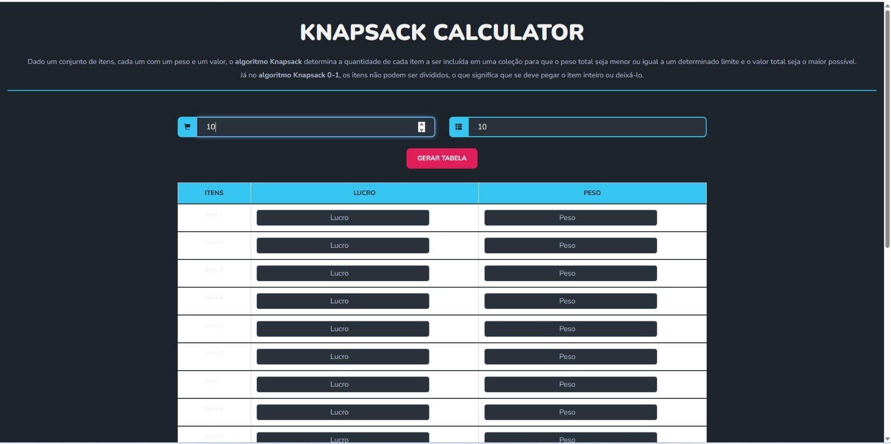

# Calculadora Knapsack

**Conteúdo da Disciplina**: Programação Dinâmica

## Alunos
| Matrícula   | Aluno                                   |
| ----------- | --------------------------------------- |
| 222006712   | Fábio Gabriel da Silva Barbosa          |
| 221022696   | Nathan Benigno Ponce de Abreu           |

## Sobre o Projeto

Este projeto é uma **Calculadora Knapsack** desenvolvida em HTML, CSS e JavaScript, com interface web responsiva. O objetivo é permitir que o usuário simule e visualize a solução dos problemas clássicos da mochila (Knapsack), tanto na versão fracionária (greedy) quanto na versão 0-1 (programação dinâmica).

### Funcionalidades

- Interface intuitiva para inserir a capacidade da mochila e o número de itens.
- Geração dinâmica de tabela para entrada dos lucros e pesos de cada item.
- Cálculo automático das soluções para:
  - **Knapsack Fracionário** (itens podem ser divididos)
  - **Knapsack 0-1** (itens inteiros, usando programação dinâmica)
- Exibição dos resultados, incluindo:
  - Lucro máximo obtido
  - Densidade dos itens
  - Solução ótima (quais itens/frações foram escolhidos)
  - Tabela de programação dinâmica para o Knapsack 0-1

### Como usar

1. Abra o arquivo `index.html` em seu navegador.
2. Insira a capacidade da mochila e o número de itens.
3. Clique em **Gerar Tabela** para inserir os lucros e pesos de cada item.
4. Após preencher todos os campos, clique em **Calcular** para ver os resultados das duas versões do problema.

### Tecnologias Utilizadas

- HTML5, CSS3 (com Bootstrap e paleta inspirada em Kurzgesagt)
- JavaScript puro (sem frameworks)
- [index.js](index.js) implementa toda a lógica dos algoritmos

## Screenshots

## vídeo

